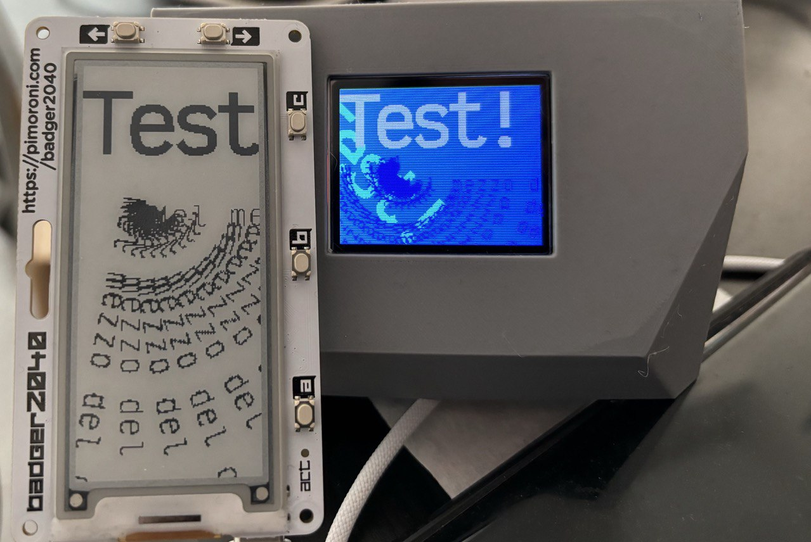

MicroFont is a MicroPython font rendering libray. It is based on the great [MicroPython font conversion tool](https://github.com/peterhinch/micropython-font-to-py) written by Peter Hinch.

Compared to the original code, I made this changes:

* Fonts are not loaded in memory but stored on disk, in MicroFont format 'MFNT' files. They use the same sparse index and data section as the original library, plus some header information that I added in order to make them able to work from flash, without loading fonts data in memory.
* Optionally, it is possible to cache in memory just the sparse index, or alternatively the index and every character used. This is useful when faster performances are needed.
* The rendering code is written from scratch, and allows blitting text in a MicroPython framebuffer without using the framebuffer primitives (in order to implement things otherwise not possible). It supports fast rotated text rendering by any angle from 0 to 360 degrees, and is written using the Viper native code emitter.
* Only horizontally mapped fonts are supported, the original library allowed for vertically mapped fonts. By implementing the blitting support for vertical mapped framebuffers (TODO), this will not be a problem, even for hardware displays that are vertically mapped (they are rare AFAIK).



So with the code you find in this repository you can:

1. Convert TTF/OTF fonts to MicroFont files.
2. Upload such files on your device flash.
3. Use the `microfont.py` MicroPython library to load fonts and render text on the framebuffer.

Currently only two framebuffer formats are supported: `MONO_HLSB` and `RGB565`. They are by far the most widespread.

## Converting fonts

In order to use your own fonts, you need to convert TTF (or OTF) fonts using the provided Python program:

    python3 font_to_microfont.py -k charset.txt myfont_regular.ttf 18 victor:R:18.mfnt

The font generated will have all the characters specified inside the `charset.txt` file, so make sure that it contains what you need, but not more than you need in order to avoid wasting space on the flash.

## Usage

```python
font = MicroFont("victor:B:18.mfnt",cache_index=True)
fb = ... some MicroPython framebuffer
color = 1 # Color must be in the framebuffer color mode format.
angle = 90
font.write("Some text", fb, framebuf.MONO_HLSB, fb_width, fb_height, x, y, color, rot=angle, x_spacing=0, y_spacing=0)
```

Unfortunately the MicroPython framebuffer lacks methods to query its width, height, color format and other attributes. So you will have to pass them as arguments to the write() method, as in the example above.

If you want to use the lower-level functions, check the code: there are methods to obtain the characters bitmaps, write a single character on the screen and so forth. They are well commented inside the code.

Please note that:

* the rot and spacing arguments must be passed by name and not by position.
* Newlines inside the string to render will create new lines of text like if it was a terminal. Like in `write("One line\nAnother line", ...)`.
* with `x_spacing` and `y_spacing` you can control the space among characters and lines.

These additional methods are also available, in order to retrieve generic fonts information:

```python
def height(): return self.height
def baseline(): return self.baseline
def max_width(): return self.max_width
def monospaced(): return self.monospaced
```

## Caching

You can cache chars or both chars an indexes by passing `cache_index` or also `cache_chars` arguments set to `True` during initialization. When character caching is enabled, index caching is automatically enabled regardless of what you provide.

Caching will store the index in memory at the first access. The index is quite small: four bytes per character, so this is a very good deal if you want to speed up rendering. However the major speed-up happens when also characters are cached in memory. In this case the memory usage is non trivial (and depends on the bitmap size of the characters and how many of them you use: they are cached independently as soon as a character is used the first time).

Here is an example of rendering speed in a Raspberry Pico 2040 with the three different modes. The timings were obtained by rendering "Hello World" with a 18 point font in a monochrome framebuffer. The rotation angle used does not affect speed.

* No caching at all: 13.33 milliseconds.
* Index caching: 9.48 milliseconds.
* Index and chars caching: 5.89 milliseconds

For most use cases, just index caching or no caching seems the best bet, rendering is anyway fast enough for many kinds of applications.

Take in mind that larger fonts take more rendering time than smaller fonts, and also more memory if character caching is used, since they are bitmap representations. Instead, the memory used by indexes only depends on the number of characters mapped, not their size.

## Fonts included in this repository

This repository contains a few example font files already converted into `MFNT` format. They are provided in a few variants. The original font used for the conversion is the [Victor Mono](https://rubjo.github.io/victor-mono/) font, released under the Open Font License.
